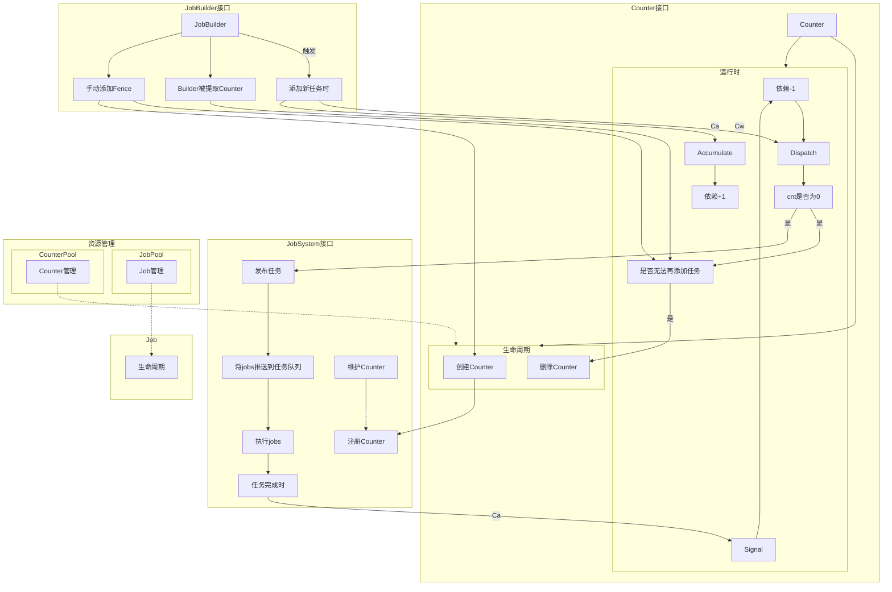

# jobsystem

```mermaid
graph TB

F1[依赖-1]
F2[依赖+1]
F3[发布任务]
F4[注册Counter]
F5[Builder被提取Counter]
F6[是否无法再添加任务]
F7[手动添加Fence]
F8[将jobs推送到任务队列]
F9[执行jobs]
F10[维护Counter]

C1[cnt是否为0]
E1[任务完成时]
E2[添加新任务时]
E3[创建Counter]
E4[删除Counter]

subgraph Counter接口
    subgraph tl[生命周期]
        E3
        E4
    end

    subgraph t2[运行时]
        Signal
        F6
        Signal-->F1-->Dispatch
        Dispatch-->C1
        Accumulate-->F2
    end
Counter-->tl
Counter-->t2

C1--是-->F6--是-->E4
end


subgraph JobBuilder接口
JobBuilder--触发-->E2
JobBuilder-->F5-->F6
JobBuilder-->F7-->F6
F7-->E3
E2--Cw-->Dispatch
E2--Ca-->Accumulate
end

subgraph JobSystem接口
C1--是-->F3
E1--Ca-->Signal
E3-->F4
F3-->F8-->F9-->E1
F10--.-->F4
end

subgraph Job
joblife[生命周期]
end

subgraph 资源管理
    subgraph JobPool
        Job管理-.->joblife
    end

    subgraph CounterPool
        Counter管理-.->tl
    end
end
```