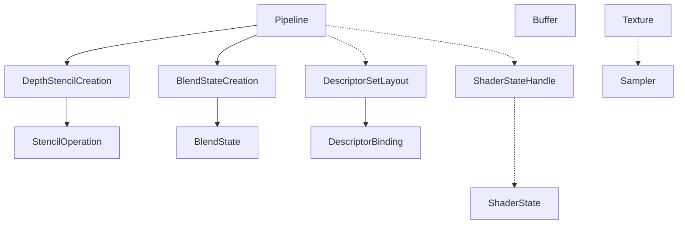

```mermaid
graph TB

r1[Pipeline]
r2[DepthStencilCreation]
r3[BlendStateCreation]
r4[StencilOperation]
r5[BlendState]
r6[DescriptorSetLayout]
r7[DescriptorBinding]
r8[ShaderState]
r9[ShaderStateHandle]

r1-.->r9
r1-.->r6
r1-->r2
r1-->r3

r2-->r4
r3-->r5
r6-->r7
r9-..->r8


re1[Buffer]
re2[Texture]
re3[Sampler]

re2-.->re3
```